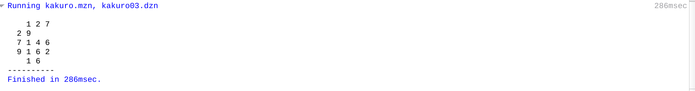
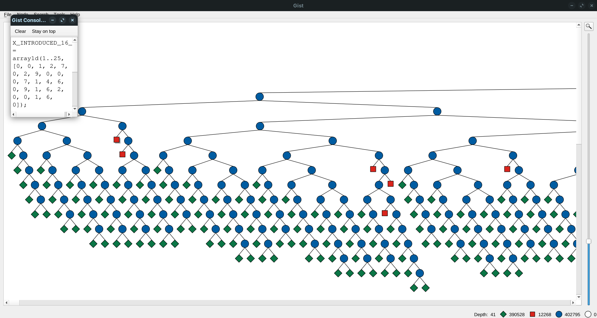
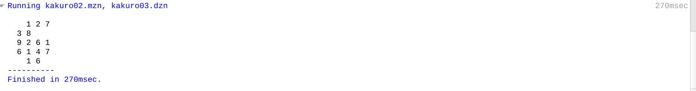
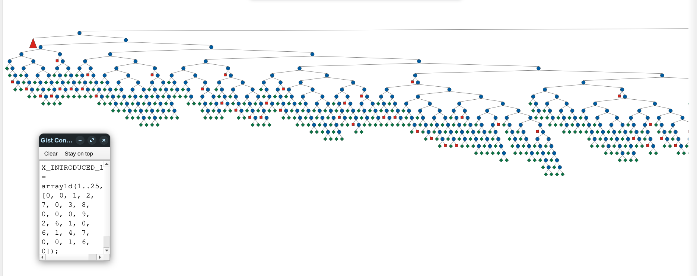
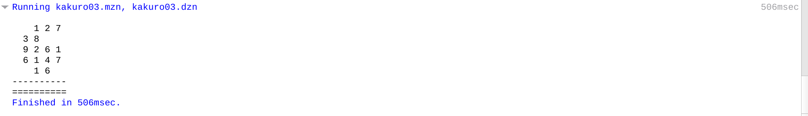
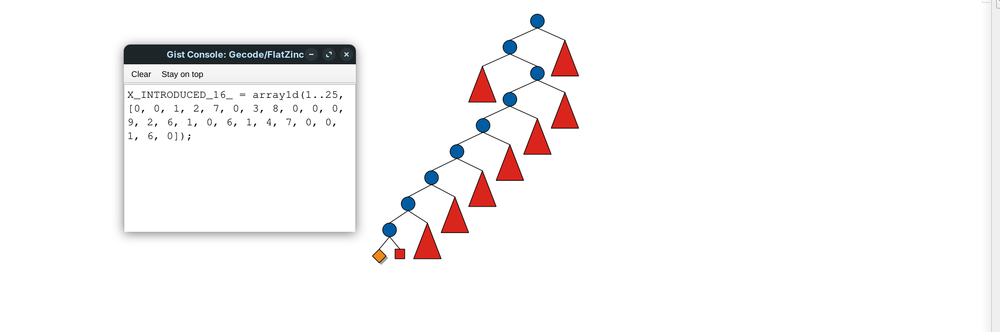
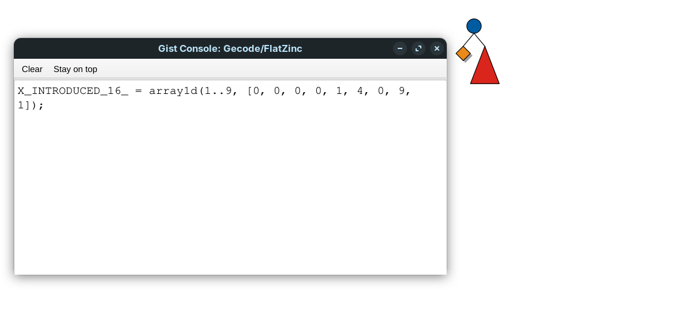
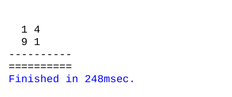
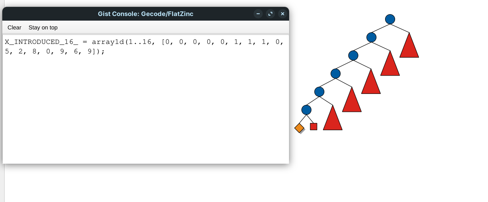
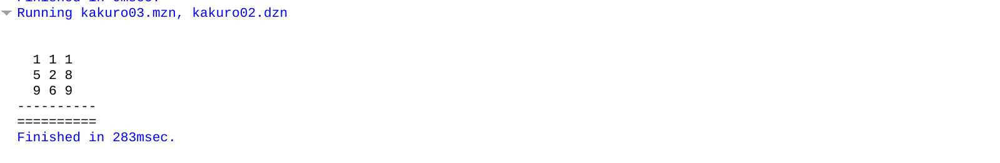

# 📌 Taller 1: Modelamiento de CSP

## **Modelado del Kakuro como CSP**

📅 **Fecha de entrega:** 17 de marzo de 2025  
👨‍💻 **Integrantes:** Joann Esteban Bedoya, Alejandro Mesa, Willian David Correa  
📂 **Repositorio:** [GitHub Classroom](https://classroom.github.com/a/agiyKqJx)

---

## 1️⃣ **Introducción**

El **Kakuro** es un rompecabezas lógico que consiste en rellenar una cuadrícula con números entre **1 y 9**, de manera que:

1. Cada **grupo horizontal o vertical** debe sumar un valor específico indicado en las pistas.
2. **No se pueden repetir números** dentro del mismo grupo.
3. Las celdas negras **actúan como separadores** y no pueden contener valores.

Este documento presenta el **modelado del Kakuro como un Problema de Satisfacción de Restricciones (CSP)**, su implementación en **MiniZinc**, y un análisis de distintas estrategias utilizadas para resolverlo.

---

## 2️⃣ **Modelado del Kakuro como CSP**

### **2.1 Definición del Problema**

El problema de Kakuro se modela como un **CSP (Constraint Satisfaction Problem)** de la siguiente manera:

- **Filas y columnas con pistas:** Cada grupo de celdas debe sumar exactamente el valor dado en la pista.
- **Sin repetición:** No se permite repetir valores dentro de un mismo grupo.
- **Celdas negras:** No contienen valores y separan los grupos.

### **2.2 Variables del Problema**

Cada celda `grid[i, j]` es una variable, donde:

- `i` representa la fila.
- `j` representa la columna.
- **Dominio:** `{1,2,3,4,5,6,7,8,9}` (solo en celdas válidas).

Se definen matrices adicionales:

- `validCell[i, j]`: Indica si una celda es válida (`1`) o una pared (`0`).
- `hsum[i, j]`: Valor de la suma que deben cumplir las celdas a la derecha.
- `vsum[i, j]`: Valor de la suma que deben cumplir las celdas hacia abajo.

## 3️⃣ **Implementación en MiniZinc**

Se implementó el modelo CSP en `kakuro.mzn`, considerando las restricciones mencionadas.

### **3.1 Archivos del Proyecto**

| **Archivo**                            | **Descripción**             |
| -------------------------------------- | --------------------------- |
| [`kakuro.mzn`](../docs/kakuro.mzn)     | Modelo MiniZinc del Kakuro. |
| [`kakuro01.dzn`](../docs/kakuro01.dzn) | Tablero **3×3**.            |
| [`kakuro02.dzn`](../docs/kakuro02.dzn) | Tablero **4×4**.            |
| [`kakuro03.dzn`](../docs/kakuro03.dzn) | Tablero **5×5**.            |

---

## 4️⃣ **Pruebas Realizadas con Diferentes Tableros**

Se realizaron pruebas con **tres instancias de Kakuro**, variando el tamaño del tablero y los valores de las pistas.

### **4.1 Prueba en Tablero 3×3 (`kakuro01.dzn`)**

🔹 **Tiempo de ejecución:**
  
🔹 **Estrategia aplicada:** _DFS_  
📂 **Captura de ejecución:**  

---

### **4.2 Prueba en Tablero 4×4 (`kakuro02.dzn`)**

🔹 **Tiempo de ejecución:**

🔹 **Estrategia aplicada:** _First Fail_  
📂 **Captura de ejecución:**  

---

### **4.3 Prueba en Tablero 5×5 (`kakuro03.dzn`)**

🔹 **Tiempo de ejecución:**
  
🔹 **Estrategia aplicada:** _Branch und Bound_  
📂 **Captura de ejecución:**  

---

## 5️⃣ **Comparación de Estrategias**

| **Estrategia**       | **Tiempo de ejecución (ms)** |
| -------------------- | ---------------------------- |
| **DFS**              | 286 ms                       |
| **First Fail**       | 270 ms                       |
| **Branch and Bound** | 506 ms                       |

📌 **Conclusión:**

- La estrategia **`first_fail`** mostró la mejor eficiencia en términos de tiempo de ejecución.
- **Branch and Bound** puede mejorar algunos casos, pero su costo computacional es mayor.
- La búsqueda en profundidad (DFS) **es la menos eficiente**, aunque garantiza encontrar solución si existe.

---

## 6️⃣ **Pruebas Adicionales con la Estrategia `first_fail`**

Dado que la estrategia **`first_fail`** mostró los mejores resultados en términos de rendimiento, se realizaron **tres pruebas adicionales** con variaciones en los tableros para evaluar su estabilidad y efectividad.

Cada una de estas pruebas contiene **dos imágenes** que muestran los resultados obtenidos en diferentes ejecuciones.

### **6.1 Prueba Adicional 1**

📂 **Capturas de ejecución:**

- 
- 

---

### **6.2 Prueba Adicional 2**

📂 **Capturas de ejecución:**

- 
- 

---

### **6.3 Prueba Adicional 3**

📂 **Capturas de ejecución:**

- 
- 

---

### **6.4 Notacion amtematica**

Definición del Problema Kakuro
Dado:

$n \in \mathbb{Z}^+$: Tamaño de la cuadrícula $n \times n$
$V = {v_{i,j} \mid i,j \in {1,2,...,n}}$ donde $v_{i,j} \in {0,1}$: Matriz de celdas válidas
$H = {h_{i,j} \mid i,j \in {1,2,...,n}}$ donde $h_{i,j} \in {0,1,...,45}$: Matriz de pistas horizontales
$V' = {v'{i,j} \mid i,j \in {1,2,...,n}}$ donde $v'{i,j} \in {0,1,...,45}$: Matriz de pistas verticales

Encontrar:

$G = {g_{i,j} \mid i,j \in {1,2,...,n}}$ donde $g_{i,j} \in {0,1,...,9}$: La cuadrícula de solución

Restricciones

1. Restricciones de validez de celdas
   ∀i,j∈{1,...,n}:vi,j=0⇒gi,j=0\forall i,j \in \{1,...,n\}: v*{i,j} = 0 \Rightarrow g*{i,j} = 0∀i,j∈{1,...,n}:vi,j​=0⇒gi,j​=0
   ∀i,j∈{1,...,n}:vi,j=1⇒gi,j∈{1,...,9}\forall i,j \in \{1,...,n\}: v*{i,j} = 1 \Rightarrow g*{i,j} \in \{1,...,9\}∀i,j∈{1,...,n}:vi,j​=1⇒gi,j​∈{1,...,9}
2. Restricciones de suma horizontal
   Para cada $i,j$ donde $h_{i,j} > 0$, sea $C^h_{i,j} = {k \mid k \in {j+1,...,n} \wedge v_{i,k} = 1}$ el conjunto de celdas válidas a la derecha:
   ∑k∈Ci,jhgi,k=hi,j\sum*{k \in C^h*{i,j}} g*{i,k} = h*{i,j}∑k∈Ci,jh​​gi,k​=hi,j​
3. Restricciones de unicidad horizontal
   Para cada $i,j$ donde $h_{i,j} > 0$:
   ∀k,l∈Ci,jh,k≠l:gi,k≠gi,l\forall k,l \in C^h*{i,j}, k \neq l: g*{i,k} \neq g\_{i,l}∀k,l∈Ci,jh​,k=l:gi,k​=gi,l​
4. Restricciones de suma vertical
   Para cada $i,j$ donde $v'{i,j} > 0$, sea $C^v{i,j} = {k \mid k \in {i+1,...,n} \wedge v_{k,j} = 1}$ el conjunto de celdas válidas hacia abajo:
   ∑k∈Ci,jvgk,j=vi,j′\sum*{k \in C^v*{i,j}} g*{k,j} = v'*{i,j}∑k∈Ci,jv​​gk,j​=vi,j′​
5. Restricciones de unicidad vertical
   Para cada $i,j$ donde $v'_{i,j} > 0$:
   ∀k,l∈Ci,jv,k≠l:gk,j≠gl,j\forall k,l \in C^v*{i,j}, k \neq l: g*{k,j} \neq g\_{l,j}∀k,l∈Ci,jv​,k=l:gk,j​=gl,j​

📌 **Conclusión:**  
Los resultados obtenidos en estas pruebas adicionales confirman que la estrategia **`first_fail`** es eficiente en la mayoría de los casos, manteniendo tiempos de ejecución bajos y estabilidad en la resolución del Kakuro. Sin embargo, algunos casos requieren ajustes específicos en el modelo CSP para mejorar la optimización.

## 6️⃣ **Conclusiones**

✔ **Modelar Kakuro como CSP permite resolverlo de manera estructurada.**  
✔ **Se probaron tableros de distintos tamaños con MiniZinc.**  
✔ **Se deben comparar estrategias como `first_fail` y `branch and bound` para mejorar la solución.**

---

## 7️⃣ **Referencias**

🔗 **Wikipedia - Kakuro**: [https://en.wikipedia.org/wiki/Kakuro](https://en.wikipedia.org/wiki/Kakuro)  
🔗 **MiniZinc Documentation**: [https://www.minizinc.org/](https://www.minizinc.org/)
