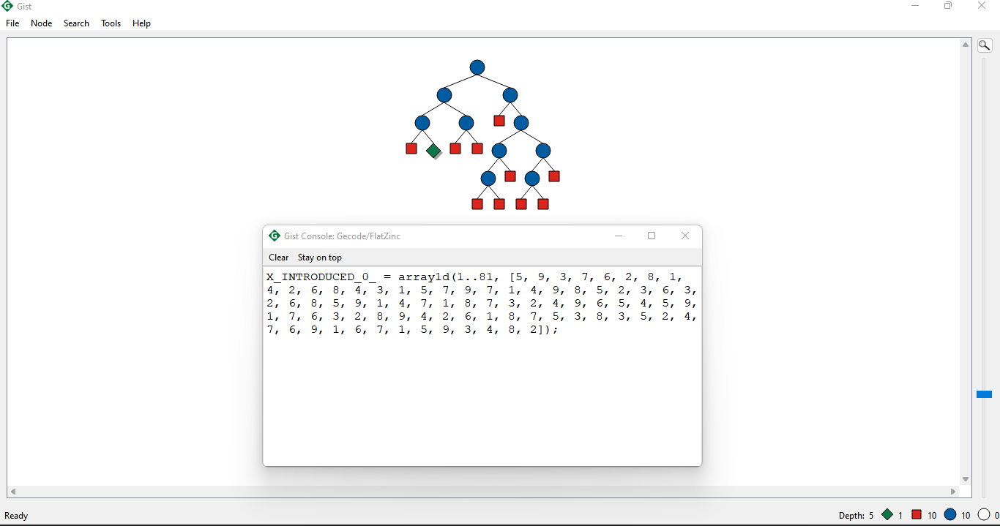
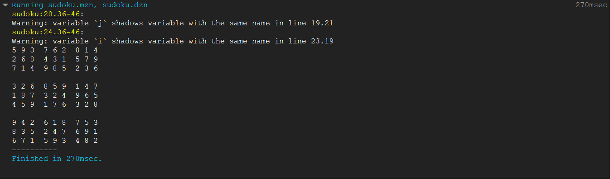
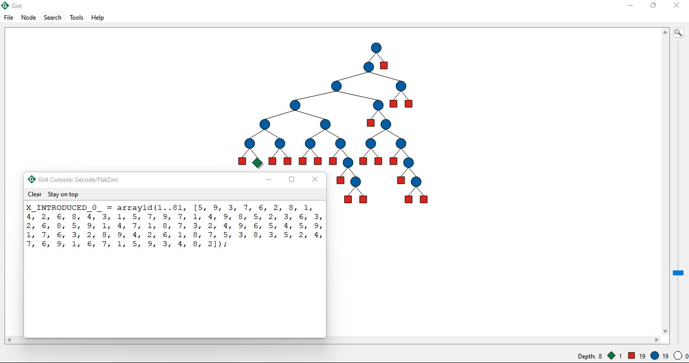
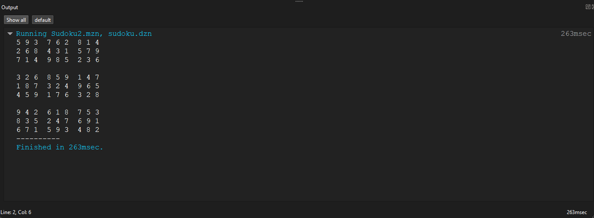
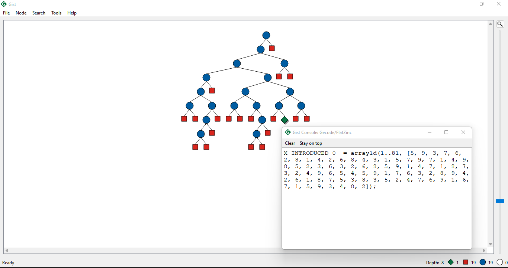
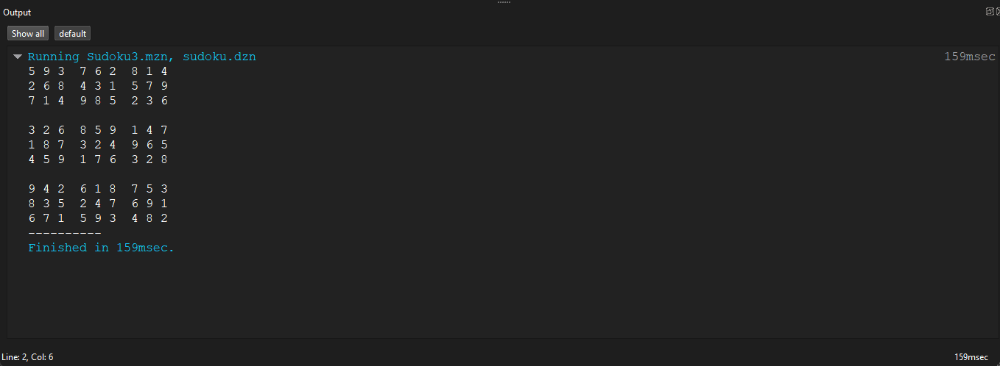
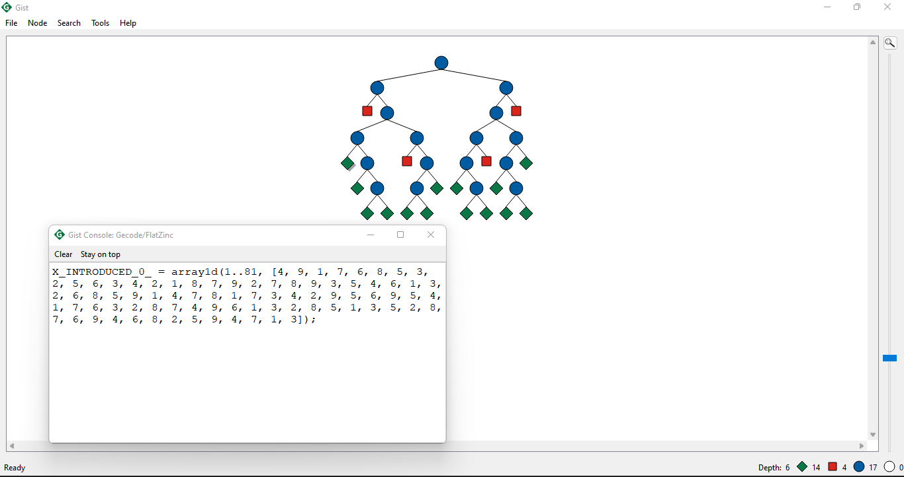
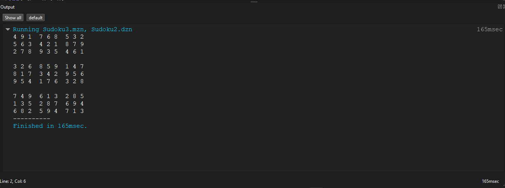
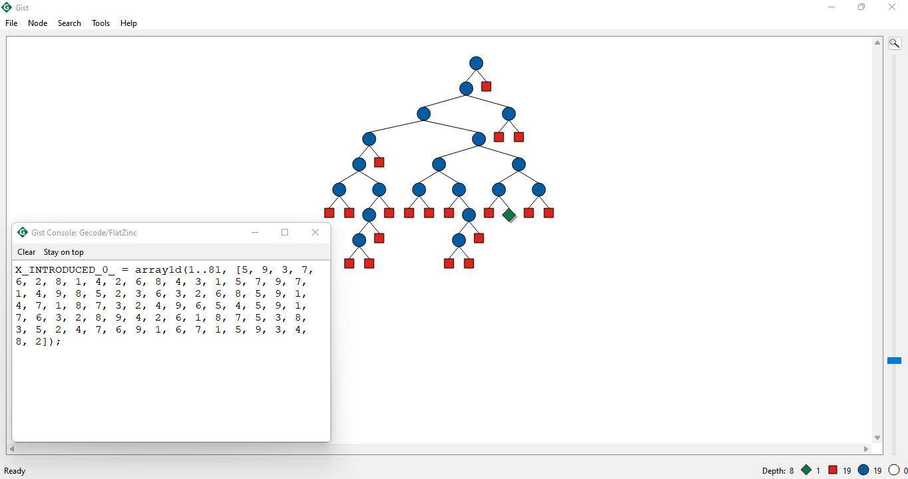
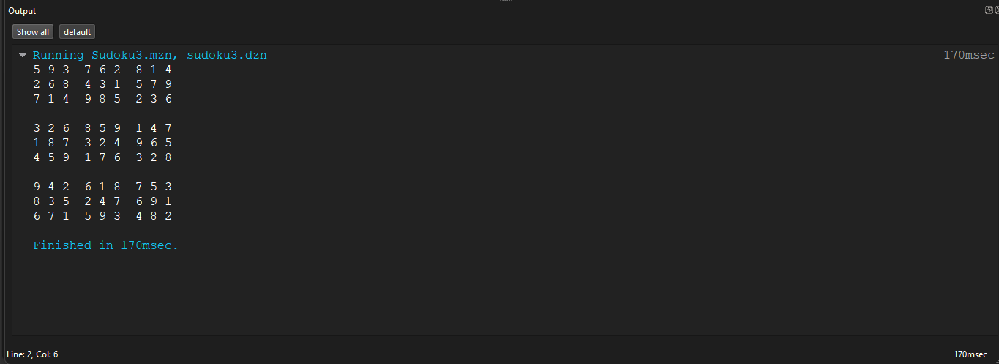

# 📌 Taller 1: Modelamiento de CSP

## **Modelado del Sudoku en Minizinc**

📅 **Fecha de entrega:** 17 de marzo de 2025  
👨‍💻 **Integrantes:** Joann Esteban Bedoya, Willian David Correa, Alejandro Mesa  
📂 **Repositorio:** [GitHub Classroom](https://classroom.github.com/a/agiyKqJx)

---

## 1️⃣ **Introducción**

El Sudoku es un rompecabezas matemático de lógica en el que se deben llenar las casillas de una cuadrícula (Que es usualmente) **9×9** con los números del 1 al 9, respetando ciertas restricciones.

Este documento presenta el **modelado del Sudoku como un Problema de Satisfacción de Restricciones (CSP)**, su implementación en **MiniZinc**, y un análisis de distintas estrategias utilizadas para resolverlo.

---

## 2️⃣ **Modelado del Sudoku como CSP**

### **2.1 Definición del Problema**

El Sudoku consiste en una cuadrícula de 9×9 donde se deben ubicar los números del 1 al 9 cumpliendo con estas restricciones:

- **Filas:** No puede haber números repetidos en la misma fila.
- **Columnas:** No puede haber números repetidos en la misma columna.
- **Subcuadrículas 3×3:** No puede haber números repetidos dentro de cada región de 3×3.

Estas son entonces las reglas del Soduko que ha de respetar y modelar acorde

### **2.2 Variables del Problema**

Cada celda vacía del Sudoku representa una variable `Xij`, donde:

- `i` es la fila (`1 ≤ i ≤ 9`).
- `j` es la columna (`1 ≤ j ≤ 9`).
- El dominio de cada celda es `{1,2,3,4,5,6,7,8,9}`.

---

## 3️⃣ **Implementación en MiniZinc**

Se implementó el modelo CSP en `sudoku.mzn`, considerando las restricciones y reglas del problema.

### **3.1 Archivos del Proyecto**

| **Archivo**                          | **Descripción**                   |
| ------------------------------------ | --------------------------------- |
| [`sudoku.mzn`](../docs/Sudoku.md)    | Documentacion para Sudoku.        |
| [`sudoku.dzn`](../docs/sudoku.mzn)   | La estrategia `alldifferent`.     |
| [`sudoku2.dzn`](../docs/sudoku2.dzn) | La estrategia `first_fail`.       |
| [`sudoku3.dzn`](../docs/sudoku3.dzn) | La estrategia `most_constrained`. |

---

## 4️⃣ **Estrategias de Solución en MiniZinc**

### **4.1 Primera Estrategia: Modelo Base**

#### **Descripción**

Este modelo utiliza la restricción `alldifferent` para filas, columnas y subcuadrículas sin aplicar heurísticas avanzadas de búsqueda.  
El solver busca una solución que cumpla las restricciones sin priorizar variables específicas.

#### **Ventajas y Desventajas**

| **Aspecto**    | **Descripción**                               |
| -------------- | --------------------------------------------- |
| **Ventaja**    | Modelo claro y fácil de comprender.           |
| **Ventaja**    | No requiere configuraciones avanzadas.        |
| **Desventaja** | No optimiza el tiempo de búsqueda.            |
| **Desventaja** | Puede ser ineficiente para Sudokus difíciles. |

📂 **Captura de ejecución:**  

⏱ **Tiempo de ejecución:**

---

### **4.2 Segunda Estrategia: Heurística `first_fail`**

#### **Descripción**

Esta estrategia utiliza **`first_fail`**, priorizando la asignación de valores en variables con menor cantidad de opciones posibles.  
Se combina con `indomain_min` para elegir los valores más pequeños disponibles en el dominio.

#### **Ventajas y Desventajas**

| **Aspecto**    | **Descripción**                                          |
| -------------- | -------------------------------------------------------- |
| **Ventaja**    | Reduce el tiempo de búsqueda.                            |
| **Ventaja**    | Minimiza el número de iteraciones innecesarias.          |
| **Desventaja** | Puede no ser óptima en Sudokus con muchas celdas vacías. |

📂 **Captura de ejecución:**  

⏱ **Tiempo de ejecución:**

---

### **4.3 Tercera Estrategia: Heurística `most_constrained` con valores aleatorios**

#### **Descripción**

Esta estrategia utiliza **`most_constrained`**, seleccionando primero las variables más restringidas, y asignando valores aleatorios (`indomain_random`).  
Esto ayuda a evitar soluciones repetitivas y mejorar la exploración del espacio de búsqueda.

#### **Ventajas y Desventajas**

| **Aspecto**    | **Descripción**                                                     |
| -------------- | ------------------------------------------------------------------- |
| **Ventaja**    | Reduce el tiempo de búsqueda al priorizar variables críticas.       |
| **Ventaja**    | Introduce aleatoriedad para evitar ciclos de búsqueda innecesarios. |
| **Desventaja** | Puede generar tiempos de ejecución variables.                       |

📂 **Captura de ejecución:**  

⏱ **Tiempo de ejecución:** _XX ms_  

---

## 5️⃣ **Comparación de Estrategias**

| **Estrategia**       | **Tiempo de ejecución (ms)** |
| -------------------- | ---------------------------- |
| **AllDifferent**     | 270 ms                       |
| **First Fail**       | 263 ms                       |
| **Most Constrained** | 159 ms                       |

📌 **Conclusión:**

- La estrategia **`first_fail`** mostró una mejora en tiempos de ejecución al priorizar las variables con menos opciones.
- La estrategia **`most_constrained`** puede ser más efectiva en algunos casos, pero introduce aleatoriedad en el tiempo de ejecución.
- El modelo base **es el menos eficiente**, adecuado solo para instancias pequeñas.

### **5.1 Prueba Adicional 1**

📂 **Capturas de ejecución:**

- 
- 

---

### **5.2 Prueba Adicional 2**

📂 **Capturas de ejecución:**

- 
- 

---

---

## 6️⃣ **Conclusiones**

**Modelar Sudoku como CSP permite resolverlo de manera estructurada y eficiente.**  
 **Las heurísticas de búsqueda (`first_fail` y `most_constrained`) mejoran significativamente la velocidad de resolución.**  
**MiniZinc facilita la experimentación con distintas estrategias de solución lo cual es muy curioso.**

---

## 7️⃣ **Referencias investigadas**

🔗 **Wikipedia - Sudoku**: [https://en.wikipedia.org/wiki/Sudoku](https://en.wikipedia.org/wiki/Sudoku)  
🔗 **MiniZinc Documentation**: [https://www.minizinc.org/](https://www.minizinc.org/)
